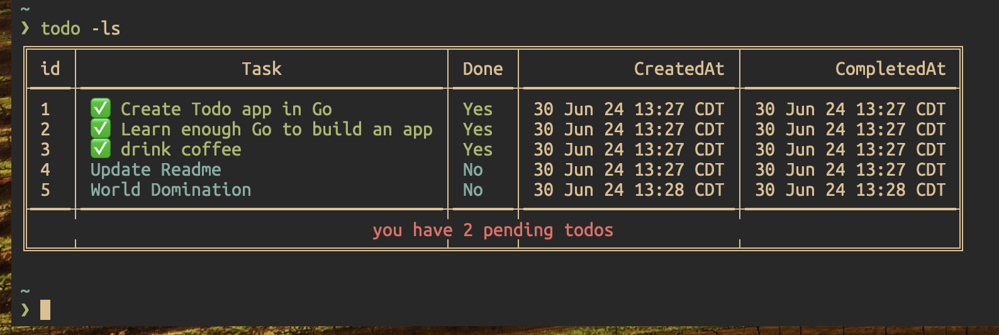

# todo-cli



I am tired of spacing out during daily standups when asked what I accomplished yesterday - I do so much during the day, but my memory fails me at the most
important time!

I also been wanting to learn Go - to checkout if it is all what the hype claims it to be

So... no better way to learn that a project

## What is it?

A lightweight CLI based To-Do application written in Go

## Requirements

- [Install Go](https://go.dev/doc/install)

## Install

Clone this repo and build the executable file using:
``` bash
go build ./cmd/todo
```

This will create the `todo` executable. If you want to be able to access this command from anywhere in your shell, you will need to add it
to your `PATH` environment variable in your `.bashrc`, `.zshrc`, etc. I will leave this one to you as homework :)

## Usage

``` bash
-ls: Lists all the todos on file
  todo -ls

-add: Adds a todo to the list
  todo -add Add a new Todo

-complete: Changes the status of a todo to complete. Receives the index of the task to change
  todo -complete=1

-delete: Deletes a todo from the list. Receives the index of the task to delete
  todo -delete=1
```
